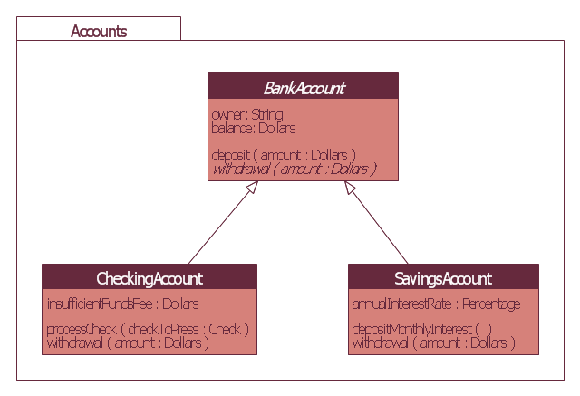

# Bank Account :bank:
Using JavaScript object methods, constructor functions and prototypes, and prototypal inheritance, creating a bank, to deposit (add more funds) and withdraw (take funds out) from their accounts.

## Requirements
A customer should be able to:
* `deposit` - deposit money into a current account
* `withdraw` - withdraw money from a current account
* `checkBalance` - check the current balance of their current account
* `viewStatement` - view a list of transactions on their current account

You will likely need to keep track of the customer's balance and transactions on a `currentAccount` object.

## Further Reading
* [Object.prototype.constructor on MDN](https://developer.mozilla.org/en-US/docs/Web/JavaScript/Reference/Global_Objects/Object/constructor)
* [Error on MDN](https://developer.mozilla.org/en-US/docs/Web/JavaScript/Reference/Global_Objects/Error)

----

### `BankAccount` constructor:
| Object      | Methods | Properties |
|-------------|---------|------------|
| BankAccount |         | balance    |

`balance` set as property with `BankAccount` as a constructor.
```js
function BankAccount(balance) {
  this.balance = balance;
}
```
In a new file `__tests__/bankaccount.test.js`, write the following code:
```js
describe('BankAccount', () => {
  it('can be instantiated', () => {
    expect(new BankAccount()).toBeInstanceOf(Object);
  });
});
```
----

### `deposit` method:
| Object      | Methods | Properties    |
|-------------|---------|---------------|
| BankAccount |         | balance       |
|             | deposit |               |
|             |         | depositAmount |

New method created `deposit` with property `depositAmount`.

In a new file `__tests__/bankaccount.test.js`, write the following code:
```js
describe('BankAccount.deposit', () => {
  it('deposit money into a current account', () => {
    const myAccount = new BankAccount(100);
    expect(myAccount.deposit(myAccount.balance)).toEqual(`Your balance is now ${myAccount.balance}`);
  });
  it('zero deposit money into an account', () => {
    const myAccount = new BankAccount(0);
    expect(myAccount.deposit(myAccount.balance)).toEqual('You have insufficient funds!');
  });
});
```
In `src/bankaccount.js`, add the following code:
```js
BankAccount.prototype.deposit = function deposit(depositAmount) {
  this.balance += depositAmount;
  if (depositAmount <= 0) {
    return ('You have insufficient funds!');
  } return (`Your balance is now ${this.balance}`);
};
```
----

### `withdraw` method:
| Object      | Methods  | Properties     |
|-------------|----------|----------------|
| BankAccount |          | balance        |
|             | deposit  |                |
|             |          | depositAmount  |
|             | withdraw |                |
|             |          | withdrawAmount |

New method created `withdraw` with property `withdrawAmount`.

In a new file `__tests__/bankaccount.test.js`, write the following code:
```js
describe('BankAccount.withdraw', () => {
  it('money withdraw with new balance', () => {
    const myAccount = new BankAccount(100);
    expect(myAccount.withdraw(myAccount.balance)).toEqual(`Your balance is now ${myAccount.balance}`);
  });
  it('zero money withdraw from account', () => {
    const myAccount = new BankAccount();
    myAccount.balance = 0;
    expect(myAccount.withdraw(myAccount.balance)).toEqual('You have insufficient funds!');
  });
});
```
In `src/bankaccount.js`, add the following code:
```js
BankAccount.prototype.withdraw = function withdraw(withdrawAmount) {
  this.balance -= withdrawAmount;
  if (withdrawAmount === 0) {
    return ('You have insufficient funds!');
  } return (`Your balance is now ${this.balance}`);
};
```
### `checkBalance` method:
| Object      | Methods      | Properties     |
|-------------|--------------|----------------|
| BankAccount |              | balance        |
|             | deposit      |                |
|             |              | depositAmount  |
|             | withdraw     |                |
|             |              | withdrawAmount |
|             | checkBalance |                |

New method created `checkBalance`.

In a new file `__tests__/bankaccount.test.js`, write the following code:
```js
describe('BankAccount.checkBalance', () => {
  it('money deposit/withdraw with correct balance', () => {
    const myAccount = new BankAccount(100);
    myAccount.balance += 100;
    myAccount.balance -= 50;
    expect(myAccount.checkBalance()).toEqual(`Your current balance is £${myAccount.balance}`);
  });
});
```
In `src/bankaccount.js`, add the following code:
```js
BankAccount.prototype.checkBalance = function checkBalance() {
  return (`Your current balance is £${this.balance}`);
};
```